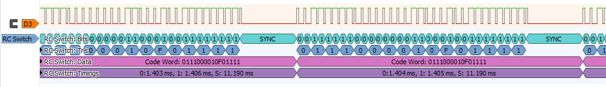

# sigrok-rc_switch
Sigrok protocol decoder for common RC Switches (usually 433 mhz)

This supports the same kind of switches as supported by the popular Arduino [rc-switch](https://github.com/sui77/rc-switch) library.

A single line of the logic analyzer should be connected to the output of a generic 433mhz receiver, which outputs only the high/low received.

Keep in mind that most of these receivers are intentionally noisy, normally you will see continuous noise, until an actual signal is received, and the receiver adjusts it's sensitivity to it.

Because almost each vendor will have a different base frequency, and I expect most people to use this to see what a unknown transmitter is sending, the protocol decoder is made to be as robust as possible. It first ignores any pulses which are too short to be an actual signal (the margin for this is an option). 0 and 1 bits are encoded as long-short, or short-long, the decoder just looks at which of two successive pulses is the longest. A sync bit is always two pulses that together are longer than the preceeding bits, that's how we detect it.

More details on how these signals are encoded can be found on the [LineCoding](https://github.com/sui77/rc-switch/wiki/KnowHow_LineCoding) wiki page of the rc-switch project.

The samples provided are created using the rc-switch project, using the 6 supported protocols. These samples should be read correctly by the decoder without changing any settings, except for the last (6) for which the polarity must be reversed.

Screenshot of the 'protocol 1' sample:

